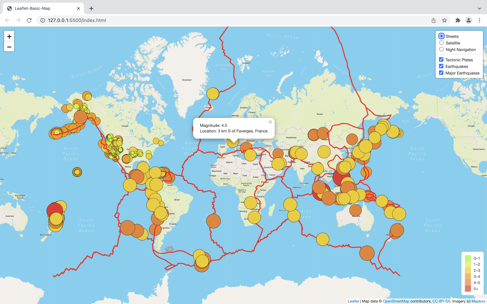
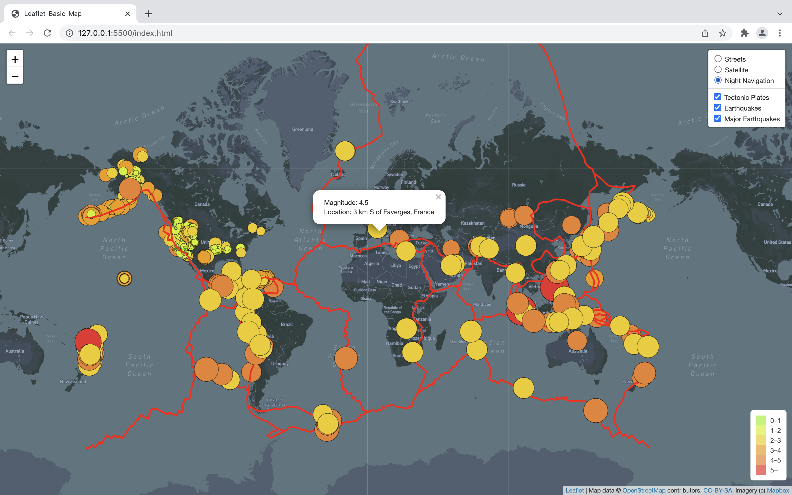

# Mapping Earthquakes

## Overview

### Purpose

The purpose of this analysis is to display tectonic plates, and earthquakes including major ones on a map of the world. Using JavaScript, APIs, Mapbox, Leaflet.js, and geoJSON data, tectonic plates and earthquake data was added to a map. Furthermore, color was added and the radius of the circle markers was set based on the magnitude of earthquake. Finally, a popup marker was added for each earthquake that displays the magnitude and location of the earthquake using the GeoJSON layer, geoJSON(). The data was provided by U.S. Geological Survey. 

### Software and Web-Based Application

* JavaScript, or JS
* HyperText Markup Language, or HTML
* Google Chrome
* Visual Studio Code, or VS Code (Version 1.62.3)

